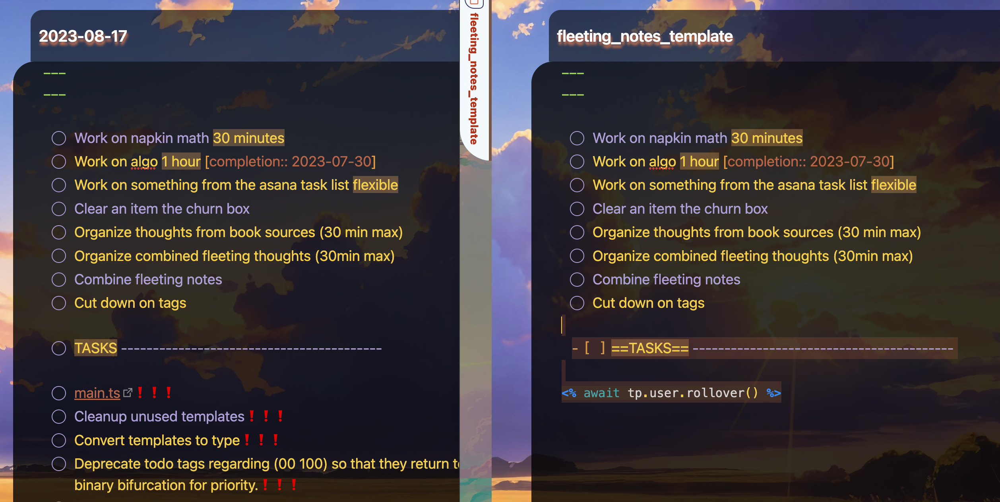

# Readme

- ORIGINAL CODE: https://gist.github.com/lenalebt/8e58aa21392c388d8c7d65bad3206e35

- :reference: https://github.com/lumoe/obsidian-rollover-daily-todos/issues/63

## Summary

The rollover.js is to be used in conjunction with the rollover plugin, daily note core plugin, and templater plugin for the ObsidianMD note taking app, ibidem, and its goal is to assist in daily templated todos.

The current rollover plugin does not work well with the templater plugin when Daily Notes are created.

So any old unfinished todos do not transfer over, one only gets the content within the original template in the newest daily note.

In order to combat this, the solution is to place a tp script to scrape the todos manually. This way, when templater overrides the notes, the content it exactly the same--as if it were not overridden in the first place.

## Examples

Demo below ⬇️

## Implementation

- Daily Notes will open a note and name it according to the day.
- Rollover Plugin will cut out all the unfinished tasks from the old and paste it to the newest Daily Note.
- Templater will override Rollover
  The tasks above the Tasks---- demarcation line will always appear every day, aka Reminder Tasks.
- The task below the Tasks--- demarction line will carry over if they are unfinished.
- The task that are finished will stay behind on the previous daily note.
  - 🤔 Completed tasks should be deleted not remain on the day before.`this.app...modify` is the api for obsidian for mutation.

# ---Transient

At first I thought that Templater and Rollover were both working but it seems like Rollover turns itself off. If Rollover was working at all, the old notes would have been deleted.
